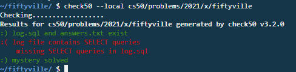

# Fiftyville Investigation
Run wget https://cdn.cs50.net/2021/x/seminars/sql/fiftyville.db

The CS50 Duck has been stolen! The town of Fiftyville has called upon you to solve the mystery of the stolen duck. Authorities believe that the thief stole the duck and then, shortly afterwards, took a flight out of town with the help of an accomplice. Your goal is to identify:

1. Who the thief is,
2. What city the thief escaped to, and
3. Who the thief's accomplice is who helped them escape

All you know is that the theft took place on July 28
and that it took place on Chamberlin Street.

Come up with a list of suspects.

# Findings Summary
(It is implied that I checked for the structure of each table before doing the queries). 

 - Happened at 10:15 (Crime Scene Report)
- Stolen at the courthouse (Crime Scene Report)

- Got on a car on courthouse parking lot within 10 minutes of the crime (Ruth, a witness)
- Thief was seen withdrawing money at an ATM at Fifer Street earlier the day (Eugene, a witness)
- Thief called someone for less than a minute when they left the courthouse (Raymond, a witness)
- Thief planned to take the earliest flight out of Fiftyville the next day (Raymond, a witness about the call)
- Accomplice talking to thief on phone call may have bought the flight tickets (Raymond, a witness)

Suspects that left the parking lot in the time frame by Ruth, the witness: 

    Patrick | (725) 555-4692 | 2963008352 | 5P2BI95
    Amber | (301) 555-4174 | 7526138472 | 6P58WS2
    Elizabeth | (829) 555-5269 | 7049073643 | L93JTIZ
    Roger | (130) 555-0289 | 1695452385 | G412CB7
    Danielle | (389) 555-5198 | 8496433585 | 4328GD8
    Russell | (770) 555-1861 | 3592750733 | 322W7JE
    Evelyn | (499) 555-9472 | 8294398571 | 0NTHK55
    Ernest | (367) 555-5533 | 5773159633 | 94KL13X

Suspects that withdrew money from the ATM machine on the day, according to Eugene, a witness: 

    Bobby | (826) 555-1652 | 9878712108 | 30G67EN
    Elizabeth | (829) 555-5269 | 7049073643 | L93JTIZ
    Victoria | (338) 555-6650 | 9586786673 | 8X428L0
    Madison | (286) 555-6063 | 1988161715 | 1106N58
    Roy | (122) 555-4581 | 4408372428 | QX4YZN3
    Danielle | (389) 555-5198 | 8496433585 | 4328GD8
    Russell | (770) 555-1861 | 3592750733 | 322W7JE
    Ernest | (367) 555-5533 | 5773159633 | 94KL13X

Suspects that called someone for less than a minute on the day, based on what Raymon, the witness, reported: 

    Bobby | (826) 555-1652 | 9878712108 | 30G67EN
    Roger | (130) 555-0289 | 1695452385 | G412CB7
    Victoria | (338) 555-6650 | 9586786673 | 8X428L0
    Madison | (286) 555-6063 | 1988161715 | 1106N58
    Russell | (770) 555-1861 | 3592750733 | 322W7JE
    Evelyn | (499) 555-9472 | 8294398571 | 0NTHK55
    Ernest | (367) 555-5533 | 5773159633 | 94KL13X
    Kimberly | (031) 555-6622 | 9628244268 | Q12B3Z3

- Destination of the first flight: London

List of passengers of the first flight of the next day:

    Bobby | (826) 555-1652 | 9878712108 | 30G67EN
    Roger | (130) 555-0289 | 1695452385 | G412CB7
    Madison | (286) 555-6063 | 1988161715 | 1106N58
    Danielle | (389) 555-5198 | 8496433585 | 4328GD8
    Evelyn | (499) 555-9472 | 8294398571 | 0NTHK55
    Edward | (328) 555-1152 | 1540955065 | 130LD9Z
    Ernest | (367) 555-5533 | 5773159633 | 94KL13X
    Doris | (066) 555-9701 | 7214083635 | M51FA04

# Queries and data extraction
```SQL
SELECT * FROM crime_scene_reports WHERE month = 7 AND day = 28;
```
    id | year | month | day | street | description
	293 | 2020 | 7 | 28 | Axmark Road | Vandalism took place at 12:04. No known witnesses.
	294 | 2020 | 7 | 28 | Boyce Avenue | Shoplifting took place at 03:01. Two people witnessed the event.
	295 | 2020 | 7 | 28 | Chamberlin Street | Theft of the CS50 duck took place at 10:15am at the Chamberlin Street courthouse. Interviews were conducted today with three witnesses who were present at the time — each of their interview transcripts mentions the courthouse.
	296 | 2020 | 7 | 28 | Widenius Street | Money laundering took place at 20:30. No known witnesses.
	297 | 2020 | 7 | 28 | Humphrey Lane | Littering took place at 16:36. No known witnesses.


The crime report id is 295, the theft happened at 10:15am at the courthouse. There are interviews that can be searched by the mentions of "courthouse". 

```SQL
select * from interviews where transcript LIKE "%courthouse%";
```
	id | name | year | month | day | transcript
	36 | Willie | 2020 | 2 | 11 | I work at the courthouse, and I saw the hit-and-run on my way into work this morning.
	92 | Julie | 2020 | 4 | 20 | I saw him talking on the phone outside the courthouse at 3:00pm.
	161 | Ruth | 2020 | 7 | 28 | Sometime within ten minutes of the theft, I saw the thief get into a car in the courthouse parking lot and drive away. If you have security footage from the courthouse parking lot, you might want to look for cars that left the parking lot in that time frame.
	162 | Eugene | 2020 | 7 | 28 | I don't know the thief's name, but it was someone I recognized. Earlier this morning, before I arrived at the courthouse, I was walking by the ATM on Fifer Street and saw the thief there withdrawing some money.
	163 | Raymond | 2020 | 7 | 28 | As the thief was leaving the courthouse, they called someone who talked to them for less than a minute. In the call, I heard the thief say that they were planning to take the earliest flight out of Fiftyville tomorrow. The thief then asked the person on the other end of the phone to purchase the flight ticket.


Search based on mention successful, though having the crime report id associated would be a lot better. Here I could look for either 1. the parking lot, 2. the ATM records, 3. phone call records or 4. check which flight left Fiftyville.


Route 1. Search for all activity on the courthouse parking lot within the time frame provided. 

```SQL
SELECT * FROM courthouse_security_logs WHERE month = 7 AND day = 28 AND hour = 10 AND minute > 4 AND minute < 26;
```
    id | year | month | day | hour | minute | activity | license_plate
	258 | 2020 | 7 | 28 | 10 | 8 | entrance | R3G7486
	259 | 2020 | 7 | 28 | 10 | 14 | entrance | 13FNH73
	260 | 2020 | 7 | 28 | 10 | 16 | exit | 5P2BI95
	261 | 2020 | 7 | 28 | 10 | 18 | exit | 94KL13X
	262 | 2020 | 7 | 28 | 10 | 18 | exit | 6P58WS2
	263 | 2020 | 7 | 28 | 10 | 19 | exit | 4328GD8
	264 | 2020 | 7 | 28 | 10 | 20 | exit | G412CB7
	265 | 2020 | 7 | 28 | 10 | 21 | exit | L93JTIZ
	266 | 2020 | 7 | 28 | 10 | 23 | exit | 322W7JE
	267 | 2020 | 7 | 28 | 10 | 23 | exit | 0NTHK55

A list of eight suspect candidates exiting the courthouse was found. Now, for checking their names and id:

```SQL
SELECT * FROM people WHERE license_plate IN 
   ...> (SELECT license_plate FROM courthouse_security_logs WHERE month = 7 AND day = 28 AND hour = 10 AND minute > 4 AND minute < 26 AND activity = "exit");
```
    id | name | phone_number | passport_number | license_plate
	221103 | Patrick | (725) 555-4692 | 2963008352 | 5P2BI95
	243696 | Amber | (301) 555-4174 | 7526138472 | 6P58WS2
	396669 | Elizabeth | (829) 555-5269 | 7049073643 | L93JTIZ
	398010 | Roger | (130) 555-0289 | 1695452385 | G412CB7
	467400 | Danielle | (389) 555-5198 | 8496433585 | 4328GD8
	514354 | Russell | (770) 555-1861 | 3592750733 | 322W7JE
	560886 | Evelyn | (499) 555-9472 | 8294398571 | 0NTHK55
	686048 | Ernest | (367) 555-5533 | 5773159633 | 94KL13X


Checking route 2: 

```SQL
select * from atm_transactions where atm_location = "Fifer Street" AND transaction_type = "withdraw" and month = 7 and day = 28;
```
    id | account_number | year | month | day | atm_location | transaction_type | amount
	246 | 28500762 | 2020 | 7 | 28 | Fifer Street | withdraw | 48
	264 | 28296815 | 2020 | 7 | 28 | Fifer Street | withdraw | 20
	266 | 76054385 | 2020 | 7 | 28 | Fifer Street | withdraw | 60
	267 | 49610011 | 2020 | 7 | 28 | Fifer Street | withdraw | 50
	269 | 16153065 | 2020 | 7 | 28 | Fifer Street | withdraw | 80
	288 | 25506511 | 2020 | 7 | 28 | Fifer Street | withdraw | 20
	313 | 81061156 | 2020 | 7 | 28 | Fifer Street | withdraw | 30
	336 | 26013199 | 2020 | 7 | 28 | Fifer Street | withdraw | 35

(why do the transaction records have no time!?) Found eight transactions for the reported activity. Now for finding the identities of the suspects (which will require the account number, since the "people" table naturally does not have this type of personal information, since a subpoena would be necessary to extract such data legally): 

```SQL
SELECT * FROM people WHERE id IN 
   ...> (SELECT person_id FROM bank_accounts WHERE account_number IN
   ...> (SELECT account_number FROM atm_transactions WHERE atm_location = "Fifer Street" AND transaction_type = "withdraw" AND month = 7 AND day = 28));
```
    id | name | phone_number | passport_number | license_plate
	395717 | Bobby | (826) 555-1652 | 9878712108 | 30G67EN
	396669 | Elizabeth | (829) 555-5269 | 7049073643 | L93JTIZ
	438727 | Victoria | (338) 555-6650 | 9586786673 | 8X428L0
	449774 | Madison | (286) 555-6063 | 1988161715 | 1106N58
	458378 | Roy | (122) 555-4581 | 4408372428 | QX4YZN3
	467400 | Danielle | (389) 555-5198 | 8496433585 | 4328GD8
	514354 | Russell | (770) 555-1861 | 3592750733 | 322W7JE
	686048 | Ernest | (367) 555-5533 | 5773159633 | 94KL13X


Checking route 3: 

```SQL
SELECT * FROM phone_calls WHERE month = 7 AND day = 28 AND duration < 60;
```
    id | caller | receiver | year | month | day | duration
	221 | (130) 555-0289 | (996) 555-8899 | 2020 | 7 | 28 | 51
	224 | (499) 555-9472 | (892) 555-8872 | 2020 | 7 | 28 | 36
	233 | (367) 555-5533 | (375) 555-8161 | 2020 | 7 | 28 | 45
	251 | (499) 555-9472 | (717) 555-1342 | 2020 | 7 | 28 | 50
	254 | (286) 555-6063 | (676) 555-6554 | 2020 | 7 | 28 | 43
	255 | (770) 555-1861 | (725) 555-3243 | 2020 | 7 | 28 | 49
	261 | (031) 555-6622 | (910) 555-3251 | 2020 | 7 | 28 | 38
	279 | (826) 555-1652 | (066) 555-9701 | 2020 | 7 | 28 | 55
	281 | (338) 555-6650 | (704) 555-2131 | 2020 | 7 | 28 | 54

Now for the identity of the thief (based on phone number): 

```SQL
SELECT * FROM people WHERE phone_number IN
   ...> (SELECT caller FROM phone_calls WHERE month = 7 AND day = 28 AND duration < 60);
```
    id | name | phone_number | passport_number | license_plate
	395717 | Bobby | (826) 555-1652 | 9878712108 | 30G67EN
	398010 | Roger | (130) 555-0289 | 1695452385 | G412CB7
	438727 | Victoria | (338) 555-6650 | 9586786673 | 8X428L0
	449774 | Madison | (286) 555-6063 | 1988161715 | 1106N58
	514354 | Russell | (770) 555-1861 | 3592750733 | 322W7JE
	560886 | Evelyn | (499) 555-9472 | 8294398571 | 0NTHK55
	686048 | Ernest | (367) 555-5533 | 5773159633 | 94KL13X
	907148 | Kimberly | (031) 555-6622 | 9628244268 | Q12B3Z3


Checking route 4:

Finding Fiftyville's airport id: 

```SQL
SELECT * FROM airports WHERE city = "Fiftyville";
```
    id | abbreviation | full_name | city
	8 | CSF | Fiftyville Regional Airport | Fiftyville

Now, getting the flight info:

```SQL
SELECT * FROM flights WHERE month = 7 AND day = 29 AND origin_airport_id = 8 ORDER BY hour;
```
    id | origin_airport_id | destination_airport_id | year | month | day | hour | minute
	36 | 8 | 4 | 2020 | 7 | 29 | 8 | 20
	43 | 8 | 1 | 2020 | 7 | 29 | 9 | 30
	23 | 8 | 11 | 2020 | 7 | 29 | 12 | 15
	53 | 8 | 9 | 2020 | 7 | 29 | 15 | 20
	18 | 8 | 6 | 2020 | 7 | 29 | 16 | 0

What's the name of the city the flight is destined to?

```SQL
SELECT * FROM airports WHERE id = 4;
```
    id | abbreviation | full_name | city
	4 | LHR | Heathrow Airport | London
	
And to check the identity of whoever was on the flight:

```SQL
SELECT * FROM people WHERE passport_number IN
   ...> (SELECT passport_number FROM passengers WHERE flight_id = 36);
```
    id | name | phone_number | passport_number | license_plate
	395717 | Bobby | (826) 555-1652 | 9878712108 | 30G67EN
	398010 | Roger | (130) 555-0289 | 1695452385 | G412CB7
	449774 | Madison | (286) 555-6063 | 1988161715 | 1106N58
	467400 | Danielle | (389) 555-5198 | 8496433585 | 4328GD8
	560886 | Evelyn | (499) 555-9472 | 8294398571 | 0NTHK55
	651714 | Edward | (328) 555-1152 | 1540955065 | 130LD9Z
	686048 | Ernest | (367) 555-5533 | 5773159633 | 94KL13X
	953679 | Doris | (066) 555-9701 | 7214083635 | M51FA04

## Verification and Conclusion
Now, one must check for the intersections between the available lists. Long queries could be made, but since I have already done that right after the seminar (I'm reviewing it now), I'll be doing some manual work this time.

The thief must be on all lists at the same time: The list of people that left the courthouse by car, the one with the ATM transactions, the one with the calls and in the fist flight the next day.
Verifying them, **Ernest** is the only one that appears in all of them. He is the thief.

Now, for the accomplice I only need to check for whoever Ernest called on that day. The number is (375) 555-8161, and it belongs to a guy called **Berthold**.

Hopefuly this is the correct result, or at least that is what the little program told me.



Here is the querie I used on that day (it was a lot of work, but I could have saved the effort by documenting the findings as I did here): 

```SQL
select * from people where phone_number IN 
	(select caller from phone_calls where year = 2020 AND month = 7 AND day = 28 AND duration < 60) AND phone_number IN 
	(select phone_number from people where passport_number IN 
	(select passport_number from passengers where flight_id = 36 AND passport_number IN 
	(select passport_number from people where id IN 
	(select person_id from bank_accounts where account_number IN 
	(select account_number from atm_transactions where atm_location = 'Fifer Street' AND month = 7 AND day = 28 AND transaction_type = 'withdraw')))));
```

Withdrew the money, were on the flight and made the call:

	id | name | phone_number | passport_number | license_plate 
	395717 | Bobby | (826) 555-1652 | 9878712108 | 30G67EN 
	449774 | Madison | (286) 555-6063 | 1988161715 | 1106N58 
	686048 | Ernest | (367) 555-5533 | 5773159633 | 94KL13X

Zé Ruela: Ernest

(Finding the accoumplice was the same process)